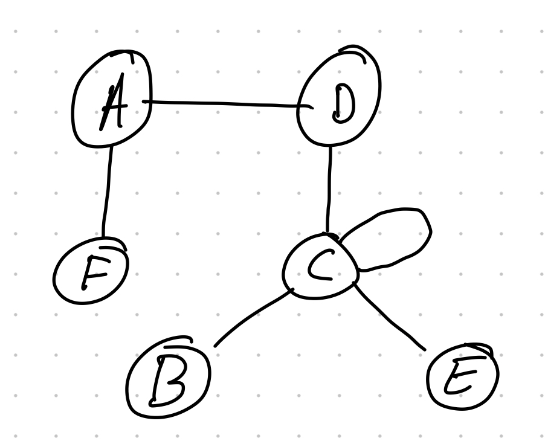
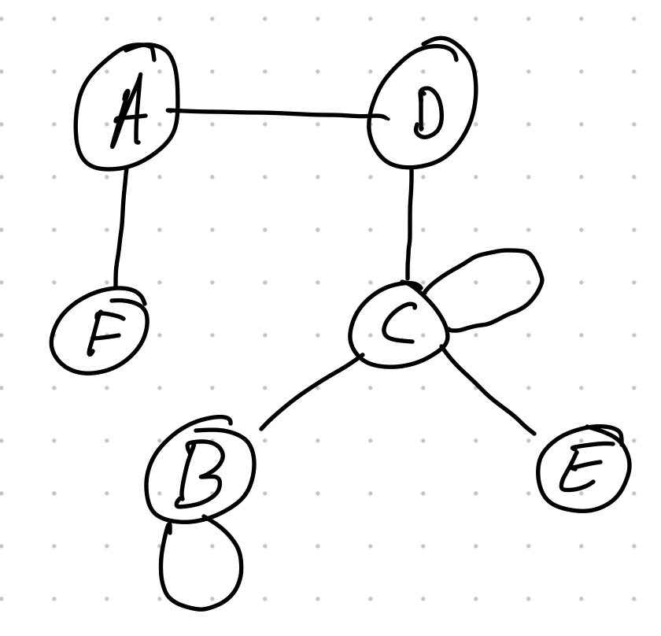

# CMPSC 413 - Lab 6 (BFS & DFS)
## Graph Traversals Implementations

**Lab Exercises:**
1. Draw a sketch of below graphs and attach the screenshot here.
```python
graph1 = { "a" : ["d","f"],
           "b" : ["c"],
           "c" : ["b", "c", "d", "e"],
           "d" : ["a", "c"],
           "e" : ["c"],
           "f" : ["a"]
         }
graph2 = { "a" : ["d","f"],
           "b" : ["c","b"],
           "c" : ["b", "c", "d", "e"],
           "d" : ["a", "c"],
           "e" : ["c"],
           "f" : ["a"]
         }
```
Draw a sketch of the above graphs and attach the screenshot here.

**Graph1:**


**Graph2:**
 

2. Develop a python program implementing Breadth First Search (BFS) algorithm. Perform a BFS on the above graphs from the previous question and attach the screenshot of the program and results here. 
Derive the time complexity of the BFS algorithm.

3. Develop a python program implementing Depth First Search (DFS) algorithm. Perform a DFS on the above graphs from the previous question and attach the screenshot of the program and results here. Derive the time complexity of the DFS algorithm.

4. Discuss the advantages and disadvantages of BFS and DFS.

5. Discus in detail an application of BFS and DFS

Deliverables: Report, codes and the demonstration video (~3 minutes)
For video demonstration, answer the following questions:
    1. Explain the program for BFS and DFS including time complexity?
