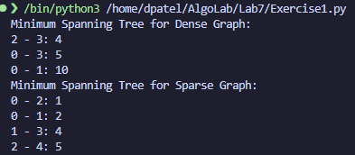
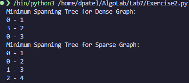

# CMPSC 413 - Lab 7
## Minimum Spanning Tree

**Exercise1: 10 Points**

**Write the Kruskal’s algorithm and briefly explain the algorithm. Perform algorithm analysis to find the time complexity. Implement the Kruskal’s algorithm and test with minimum 2 graph examples. Use 1 example for a dense graph and 1 example for a sparse graph.**

Kruskal's algorithm is a widely used algorithm for finding the minimum spanning tree (MST) of a connected, undirected graph. The minimum spanning tree is a subset of the graph's edges that connects all the vertices while minimizing the total edge weight. The algorithm works as follows:

1. Initialize an empty set of edges, which will eventually form the minimum spanning tree. 
2. Sort all the edges in the graph in non-decreasing order of their weights. 
3. Start with the edge with the smallest weight.
4. Add the edge to the MST if adding it does not create a cycle in the MST.
5. Continue adding edges in increasing order of their weights while ensuring that no cycles are formed.
6. Repeat steps 4 and 5 until the MST contains V-1 edges, where V is the number of vertices in the graph.

Analysis - Time Complexity:

1. Sorting the edges takes O(E * log(E)) time, where E is the number of edges.
2. Initializing the empty set of edges takes O(E) time.
3. Checking for cycles can be efficiently done using a data structure like a disjoint-set (or union-find) data structure, which can perform operations like union and find in nearly constant time.
4. We perform E-1 iterations to add edges to the MST.
5. Overall, the time complexity of Kruskal's algorithm is O(E * log(E)) due to the sorting step.

Outputs:



**Exercise2: 10 Points**

**Write the Prim’s algorithm and briefly explain the algorithm. Perform algorithm analysis to find the time complexity. Implement the Prim’s algorithm and test with minimum 2 graph examples (use the same examples as in exercise-1).**

Prim's algorithm is a greedy algorithm used to find the minimum spanning tree (MST) of a connected, undirected graph. The MST is a subset of the graph's edges that connects all the vertices while minimizing the total edge weight. Prim's algorithm works as follows:

1. Initialize an empty set to represent the MST and a priority queue (min-heap) to store candidate edges.
2. Start with an arbitrary vertex as the initial MST, add it to the MST set, and enqueue its edges into the priority queue.
3. While the MST set does not contain all vertices:

    a. Remove the edge with the smallest weight from the priority queue.

    b. If one of the edge's vertices is already in the MST set and the other is not, add the non-MST vertex to the MST set and enqueue its edges.

4. Repeat step 3 until the MST contains all vertices.

Analysis - Time Complexity:

1. The priority queue operations (insertion, deletion, and retrieval of the minimum element) take O(log V) time, where V is the number of vertices.
2. In the worst case, all edges are processed, resulting in O(E) operations.
3. Therefore, the overall time complexity of Prim's algorithm is O(V log V + E).

Outputs:



**Exercise3: 10 Points**

**Discuss minimum 3 differences between Kruskal’s and Prim’s algorithm. Briefly explain any 2 practical applications.**

Differences:
1. Algorithm Approach:
   - Kruskal's Algorithm: Kruskal's algorithm follows a greedy approach by selecting edges based on their weights, starting with the smallest weight edge and adding edges one by one while ensuring that no cycles are formed. It treats each vertex as a separate component and merges them as edges are added.
   - Prim's Algorithm: Prim's algorithm also uses a greedy approach, but it starts from a single vertex and grows the spanning tree by adding edges to the vertex closest to the existing tree. It maintains a set of vertices in the tree and iteratively adds the closest vertex not in the tree until all vertices are included.

2. Data Structure Used:
    - Kruskal's Algorithm: Kruskal's algorithm typically uses a disjoint-set data structure (also known as a union-find data structure) to keep track of the connected components. It efficiently checks for the presence of cycles and merges components.
    - Prim's Algorithm: Prim's algorithm often uses a priority queue (min-heap) to efficiently select the nearest vertex to the current tree. It keeps track of distances from the current tree to all other vertices.

3. Edge Selection Criteria:
    - Kruskal's Algorithm: In Kruskal's algorithm, edges are selected based solely on their weights, without considering the order in which vertices are added to the minimum spanning tree. This can lead to the selection of edges that do not immediately connect the growing tree.
    - Prim's Algorithm: In Prim's algorithm, the nearest vertex to the existing tree is added, and edges are selected based on the distances from the tree. It ensures that the tree continuously grows in a connected manner.
  
Practical Applications:
1. Network Design:

    Both Kruskal's and Prim's algorithms are widely used in network design, such as in telecommunications and computer networks. They help optimize the placement of network cables or transmission lines to minimize the cost while ensuring that all locations are connected.

2. Spanning Tree or Clustering:

    Minimum spanning trees are used in clustering algorithms in data analysis and machine learning. The structure of a minimum spanning tree can reveal the underlying relationships between data points, making it useful for clustering and feature selection.

3. Circuit Design:

    In electronic circuit design, minimum spanning trees are employed to connect various components efficiently. By selecting the minimum-weight connections, designers can reduce the overall cost and improve the performance of the circuit.

Deliverables: Report, codes and the demonstration video (~3 minutes)
For video demonstration, answer the following questions:
1. Using your codes, Explain the working of Kruskal’s algorithm?
2. Using your codes, Explain the working of Prim’s algorithm?


# Codes

## Exercise 1

```python
class Graph:
    def __init__(self, vertices):
        self.V = vertices
        self.graph = []

    def add_edge(self, u, v, w):
        self.graph.append((u, v, w))

def kruskal(graph):
    # Sort the edges in non-decreasing order of their weights.
    graph.graph = sorted(graph.graph, key=lambda item: item[2])
    parent = [i for i in range(graph.V)]  # Initialize each vertex as its parent.
    mst = []  # Initialize an empty list to store the Minimum Spanning Tree edges.
    edges_added = 0  # Initialize the count of edges added to the MST.
    index = 0  # Initialize the index for iterating through sorted edges.

    while edges_added < graph.V - 1:
        u, v, w = graph.graph[index]
        index += 1
        x = find(parent, u)
        y = find(parent, v)

        # Check if adding the edge (u, v) would create a cycle in the MST.
        if x != y:
            mst.append((u, v, w))  # Add the edge to the MST.
            union(parent, x, y)  # Union the sets of vertices x and y.
            edges_added += 1

    return mst  # Return the Minimum Spanning Tree as a list of edges.

def find(parent, i):
    # Find the representative (root) of the set that contains vertex i.
    if parent[i] == i:
        return i
    return find(parent, parent[i])

def union(parent, x, y):
    # Union two sets represented by x and y.
    x_set = find(parent, x)
    y_set = find(parent, y)
    parent[x_set] = y_set

# Example 1: Dense graph
g1 = Graph(4)
g1.add_edge(0, 1, 10)
g1.add_edge(0, 2, 6)
g1.add_edge(0, 3, 5)
g1.add_edge(1, 3, 15)
g1.add_edge(2, 3, 4)

mst1 = kruskal(g1)
print("Minimum Spanning Tree for Dense Graph:")
for u, v, w in mst1:
    print(f"{u} - {v}: {w}")

# Example 2: Sparse graph
g2 = Graph(5)
g2.add_edge(0, 1, 2)
g2.add_edge(0, 2, 1)
g2.add_edge(1, 2, 3)
g2.add_edge(1, 3, 4)
g2.add_edge(2, 4, 5)

mst2 = kruskal(g2)
print("Minimum Spanning Tree for Sparse Graph:")
for u, v, w in mst2:
    print(f"{u} - {v}: {w}")
```

## Exercise 2

```python
class Graph:
    def __init__(self, vertices):
        self.V = vertices
        self.graph = [[] for _ in range(vertices)]

    def add_edge(self, u, v, w):
        # Add an edge to the graph with vertices u, v, and weight w.
        self.graph[u].append((v, w))
        self.graph[v].append((u, w))

def prim(graph):
    MST = []
    visited = [False] * graph.V
    key = [float('inf')] * graph.V  # Initialize key values as infinity for all vertices.
    parent = [-1] * graph.V  # Initialize parent values as -1 for all vertices.

    # Start with the first vertex as the root.
    key[0] = 0

    for _ in range(graph.V):
        # Find the vertex with the minimum key value among the vertices not yet included in MST.
        min_key = float('inf')
        for v in range(graph.V):
            if not visited[v] and key[v] < min_key:
                min_key = key[v]
                u = v

        visited[u] = True

        # Update key and parent values of adjacent vertices.
        for neighbor, edge_weight in graph.graph[u]:
            if not visited[neighbor] and edge_weight < key[neighbor]:
                key[neighbor] = edge_weight
                parent[neighbor] = u

    # Construct the MST using the parent array.
    for v in range(1, graph.V):
        MST.append((parent[v], v))

    return MST

# Example 1: Dense graph
g1 = Graph(4)
g1.add_edge(0, 1, 10)
g1.add_edge(0, 2, 6)
g1.add_edge(0, 3, 5)
g1.add_edge(1, 3, 15)
g1.add_edge(2, 3, 4)

mst1 = prim(g1)
print("Minimum Spanning Tree for Dense Graph:")
for u, v in mst1:
    print(f"{u} - {v}")

# Example 2: Sparse graph
g2 = Graph(5)
g2.add_edge(0, 1, 2)
g2.add_edge(0, 2, 1)
g2.add_edge(1, 2, 3)
g2.add_edge(1, 3, 4)
g2.add_edge(2, 4, 5)

mst2 = prim(g2)
print("Minimum Spanning Tree for Sparse Graph:")
for u, v in mst2:
    print(f"{u} - {v}")
```