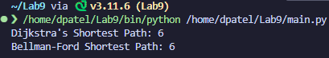

# CMPSC 413 - Lab 9
## Shortest Path Algorithms

### Lab Exercises:
1. Choose any application/example of your interest and demonstrate the working of shortest path algorithms. You need to implement and demonstrate any two shortest path algorithms (single source or All-pairs or one in each).

Your report should include the following: (attach appropriate screenshots)

1. Introduction about the application:
    
    Creating a complete IP routing application involves several components, including network topology, routing tables, packet forwarding, and user interface. Due to time constraints, I simplified the application so it that demonstrates the use of two different shortest-path algorithms: Dijkstra's algorithm and Bellman-Ford algorithm. This code assumes a simple graph representation of a network and focuses on routing.

2. Algorithm and Description about the shortest path algorithms:
    
    This code uses the NetworkX library to represent the network graph and implement Dijkstra's and Bellman-Ford algorithms for finding the shortest path between two nodes.

    - **Dijkstra's Algorthim:**

        Dijkstra's algorithm is designed to find the shortest path between two nodes in a weighted graph. It starts from the source node and explores the neighboring nodes, updating the distance from the source to each neighboring node. It maintains a priority queue to always select the node with the currently shortest known distance. The process continues until the destination node is reached or all reachable nodes are visited.

    - **Bellman-Ford Algorithm:**
  
        The Bellman-Ford algorithm also finds the shortest path between two nodes in a weighted graph but can handle graphs with negative edge weights. It iteratively relaxes all edges in the graph, updating the distance estimates for each node. This process is repeated for the number of vertices minus one times to ensure convergence. If, after all iterations, a shorter path is found, it indicates the presence of a negative weight cycle.

    In summary, both algorithms find the shortest path in weighted graphs, but Dijkstra's algorithm is more efficient and suitable for graphs with non-negative edge weights, while Bellman-Ford can handle graphs with negative edge weights and can detect the presence of negative cycles.

3. Time Complexity analysis of the algorithms:
    
    - **Dijkstra's Algorithm:**

        **Time Complexity:** O((V + E) * log(V)) with a binary heap priority queue implementation, where V is the number of vertices (nodes) and E is the number of edges in the graph.

        Dijkstra's algorithm with a binary heap priority queue has a time complexity dominated by the extraction of the minimum element from the priority queue, which is O(log(V)) per operation. Since this operation is performed for each vertex and each edge, the overall time complexity is O((V + E) * log(V)).

    - **Bellman-Ford Algorithm:**

        **Time Complexity:** O(V * E) where V is the number of vertices (nodes) and E is the number of edges in the graph.

        Bellman-Ford performs relaxation (updating distance estimates) for all edges in each of V-1 iterations, where V is the number of vertices. Each relaxation operation takes O(E) time, resulting in a total time complexity of O(V * E).

4. Implmentation and results:

    **CREATING THE GRAPH**
    ```python
    routing_graph = RoutingGraph()
    routing_graph.add_edge('A', 'B', 1)
    routing_graph.add_edge('A', 'C', 3)
    routing_graph.add_edge('B', 'D', 2)
    routing_graph.add_edge('C', 'D', 1)
    routing_graph.add_edge('D', 'E', 3)
    ```

    **DIJKSTRA'S ALGORITHM**
    ```python
    def dijkstra_shortest_path(self, source, destination):
        distances = {node: float('inf') for node in self.graph.nodes}
        distances[source] = 0
        priority_queue = [(0, source)]

        while priority_queue:
            current_distance, current_node = heapq.heappop(priority_queue)

            if current_distance > distances[current_node]:
                continue

            for neighbor, weight in self.graph[current_node].items():
                distance = current_distance + weight['weight']
                if distance < distances[neighbor]:
                    distances[neighbor] = distance
                    heapq.heappush(priority_queue, (distance, neighbor))

        return distances[destination]
    ```

    **BELLMAN_FORD ALGORITHM**
    ```python
    def bellman_ford_shortest_path(self, source, destination):
        distances = {node: float('inf') for node in self.graph.nodes}
        distances[source] = 0

        for _ in range(len(self.graph.nodes) - 1):
            for node1, node2, weight in self.graph.edges(data='weight'):
                if distances[node1] + weight < distances[node2]:
                    distances[node2] = distances[node1] + weight

        return distances[destination]
    ```

    **RESULTS**
    
    

5. Conculsion:
    The exercise involved creating a simple IP routing application using two different shortest-path algorithms: Dijkstra's algorithm and the Bellman-Ford algorithm. In the provided code snippet, I demonstrated the implementation of these algorithms using the NetworkX library in Python. Here's a detailed explanation of the exercise:

    1. RoutingGraph Class:
        - I created a `RoutingGraph` class to represent a network graph. This class uses the NetworkX library to define a graph, add edges with weights, and implement methods for Dijkstra's and Bellman-Ford algorithms.

    2. Graph Representation:
        - The network is represented as an undirected graph, where nodes represent routers or network devices, and edges represent connections between them. Each edge has a weight, representing the cost or distance between nodes.
    
    3. Dijkstra's Algortitm 
        - The `dijkstra_shortest_path` method implements Dijkstra's algorithm to find the shortest path between two nodes in the graph. It uses a priority queue to efficiently select the node with the currently shortest known distance during each iteration.
   
    4. Bellman-Ford Algorithm
        - The `bellman_ford_shortest_path` method implements the Bellman-Ford algorithm. This algorithm handles graphs with negative edge weights. It iteratively relaxes all edges for a specified number of iterations (V-1 times), updating distance estimates.
   
    5. NetworkX Library
        - The code uses the NetworkX library to work with graphs efficiently. NetworkX provides a convenient and powerful set of tools for working with graphs and implementing graph algorithms.
   
    6. Limitations and Simplifications:
        - The code is a simplified demonstration and lacks features found in real-world routing applications. A complete routing application would involve more sophisticated handling of routing tables, dynamic network changes, and integration with networking hardware.
 
6. Code 

```python
import networkx as nx
import heapq

class RoutingGraph:
    def __init__(self):
        self.graph = nx.Graph()

    def add_edge(self, node1, node2, weight):
        self.graph.add_edge(node1, node2, weight=weight)
        self.graph.add_edge(node2, node1, weight=weight)

    def dijkstra_shortest_path(self, source, destination):
        distances = {node: float('inf') for node in self.graph.nodes}
        distances[source] = 0
        priority_queue = [(0, source)]

        while priority_queue:
            current_distance, current_node = heapq.heappop(priority_queue)

            if current_distance > distances[current_node]:
                continue

            for neighbor, weight in self.graph[current_node].items():
                distance = current_distance + weight['weight']
                if distance < distances[neighbor]:
                    distances[neighbor] = distance
                    heapq.heappush(priority_queue, (distance, neighbor))

        return distances[destination]

    def bellman_ford_shortest_path(self, source, destination):
        distances = {node: float('inf') for node in self.graph.nodes}
        distances[source] = 0

        for _ in range(len(self.graph.nodes) - 1):
            for node1, node2, weight in self.graph.edges(data='weight'):
                if distances[node1] + weight < distances[node2]:
                    distances[node2] = distances[node1] + weight

        return distances[destination]

# Example Usage
routing_graph = RoutingGraph()
routing_graph.add_edge('A', 'B', 1)
routing_graph.add_edge('A', 'C', 3)
routing_graph.add_edge('B', 'D', 2)
routing_graph.add_edge('C', 'D', 1)
routing_graph.add_edge('D', 'E', 3)

# Dijkstra's algorithm
dijkstra_result = routing_graph.dijkstra_shortest_path('A', 'E')
print(f'Dijkstra\'s Shortest Path: {dijkstra_result}')

# Bellman-Ford algorithm
bellman_ford_result = routing_graph.bellman_ford_shortest_path('A', 'E')
print(f'Bellman-Ford Shortest Path: {bellman_ford_result}')
```
